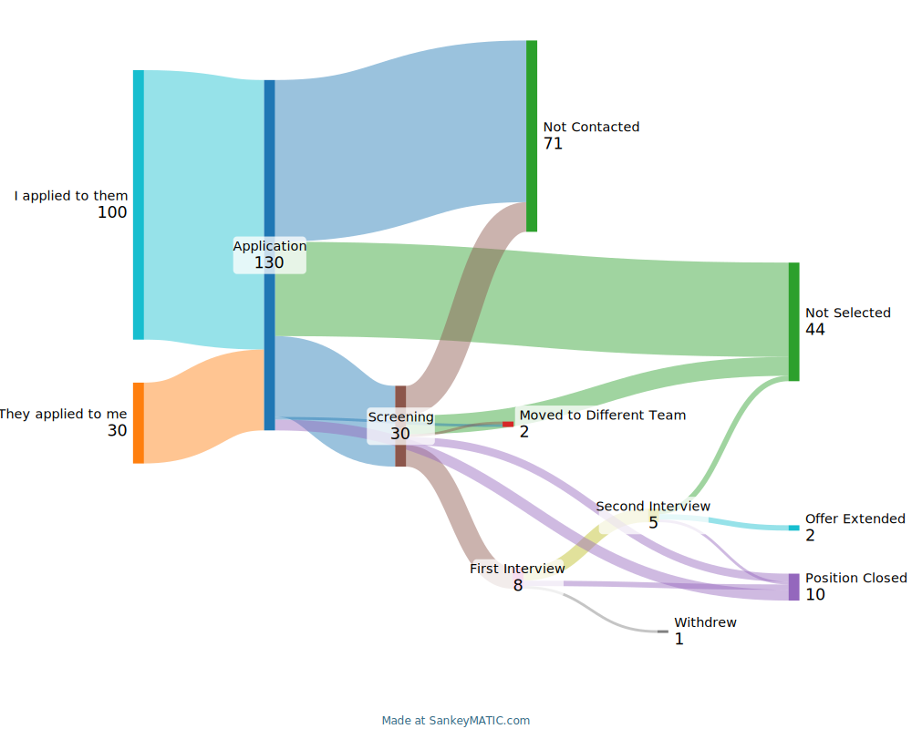

# Sankey Pandas Jobhunting CSV Processor

This Python script interactively parses a CSV file containing job hunting activity data, with one row per application, using Pandas and outputs either markup formatted for use with [SankeyMATIC](https://sankeymatic.com/), an online tool for generating Sankey diagrams, or local graphic visualization using Plotly. The CSV is processed using the column headers as labels, with entries normalized to title case. The script specifically filters out entries where the 'Outcome' column is 'Diary Update', ensuring they are not included in the final analysis. Empty entries in the 'Outcome' column are marked as 'Pending'.

## Prerequisites

- Python 3.x installed
- Ability to use command line tools
- Basic understanding of virtual environments in Python

## CSV Input Requirements

The script expects a CSV file with specific column headers, as it uses these headers to map and process the data. An example CSV is included. The expected columns are:

- `Who Applied?`: Specifies who applied for the job. Entries should be either 'Me' or 'Them', and will be normalized to title case.
- `Application Date`: While the expectation is that this field will contain a date, the script checks for any non-null value to denote an application entry.
- `Screening Date`: Similarly, any non-null entry here indicates a screening event.
- `First Interview`: Non-null entries mark the occurrence of a first interview.
- `Second Interview`: Non-null values are treated as second interview events.
- `Outcome`: The result of the application process. Entries may be in mixed case but will be normalized to title case. Rows where the 'Outcome' is 'Diary Update' are excluded from processing. If this field is empty, it will be marked as 'Pending'. It is advisable to be consistent with your 'outcome' values for a meaningful diagram but really you can put any values you like.

Please ensure that your CSV file includes these columns. Any additional columns present will be ignored. Entries within columns may be in mixed case but will be rendered in title case.

## Installation

Assuming the use of a virtual environment to manage dependencies locally without affecting system-wide Python packages.

### Setup Virtual Environment

Create a virtual environment in your project directory:

```bash
python3 -m venv ./myenv
```

Activate the virtual environment for your session:

```bash
source myenv/bin/activate
```

### Install Dependencies

Install the required Python packages:

```bash
pip3 install -r requirements.txt
```

## Usage

Run the script from the command line:

```bash
python3 main.py 
```

Follow the prompts to input the path of your CSV file or select one from the current directory.

You will be prompted to choose the output format:

1. **Console**: Prints the output directly to the console - suitable for SankeyMATIC.
2. **Output File**: Saves the output in a text file named `sankeymatic_markup.txt` suitable for SankeyMATIC.
3. **Plotly Diagram**: Generates a Sankey diagram locally using Plotly. You can choose to save this diagram in SVG, PNG, or JPG format. No external services required
## Sample Output

Output is printed directly to the console and to a file `sankeymatic_markup.txt` suitable for input into SankeyMATIC:

**N.B. Below values are fuzzed/synthetic. Whilst representative they do not illustrate figures from an actual job search**

```
// Generated 11 May 14:00
// Go to https://sankeymatic.com/ to use this to generate your Sankey diagram

I applied to them [100] Application
They applied to me [30] Application
Application [60] Not Contacted
Application [1] Moved to Different Team
Application [4] Position Closed
Application [35] Not Selected
Application [30] Screening
Screening [8] First Interview
Screening [11] Not Contacted
Screening [1] Moved to Different Team
Screening [3] Position Closed
Screening [7] Not Selected
First Interview [1] Withdrew
First Interview [2] Position Closed
First Interview [5] Second Interview
Second Interview [2] Offer Extended
Second Interview [1] Position Closed
Second Interview [2] Not Selected
```
### Sample diagram using SankeyMATIC with above



### Sample diagram using plotly with same data


## Cleanup (Optional)

To deactivate the virtual environment and remove it if no longer needed:

```bash
deactivate
rm -r myenv
```
